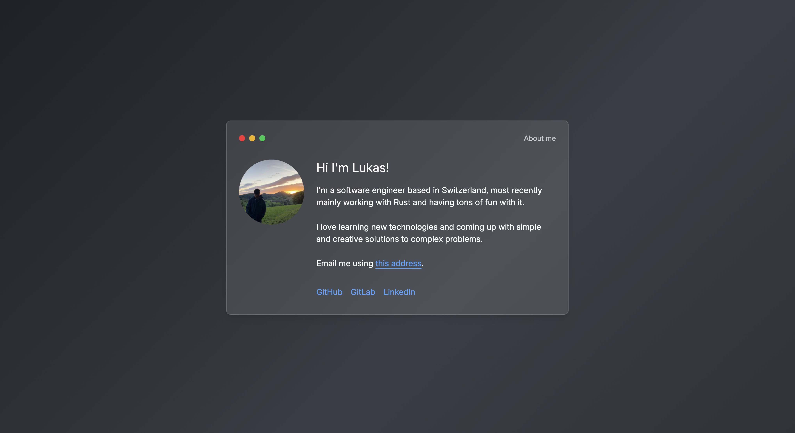

# [weblu.ch](https://weblu.ch) - My personal website



This website is built using Svelte. I previously didn't have much experience with it and used the opportunity to learn it better.

## Getting started

Install npm packages:

```sh
npm install
```

Run the website locally:

```sh
npm run dev
```
